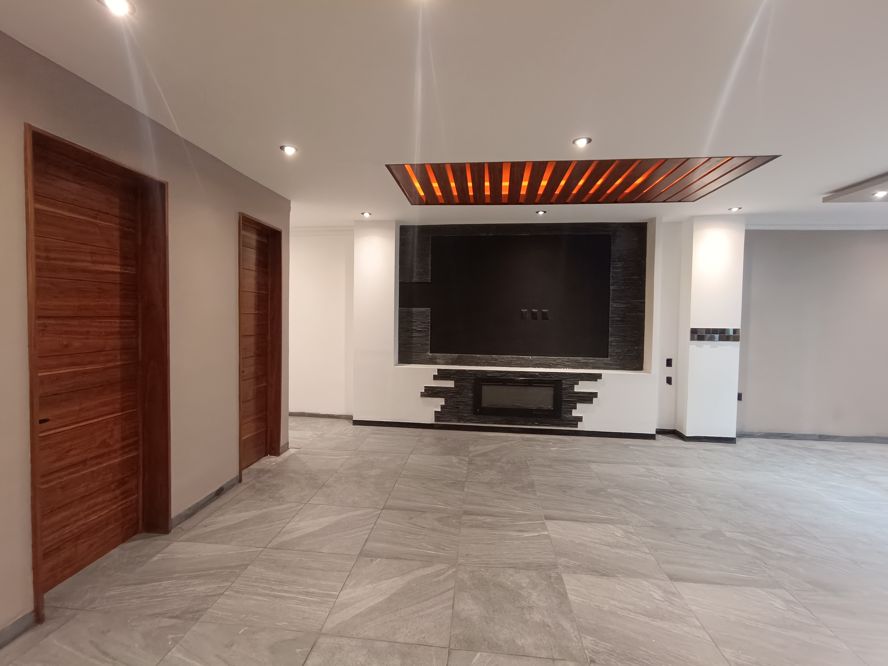
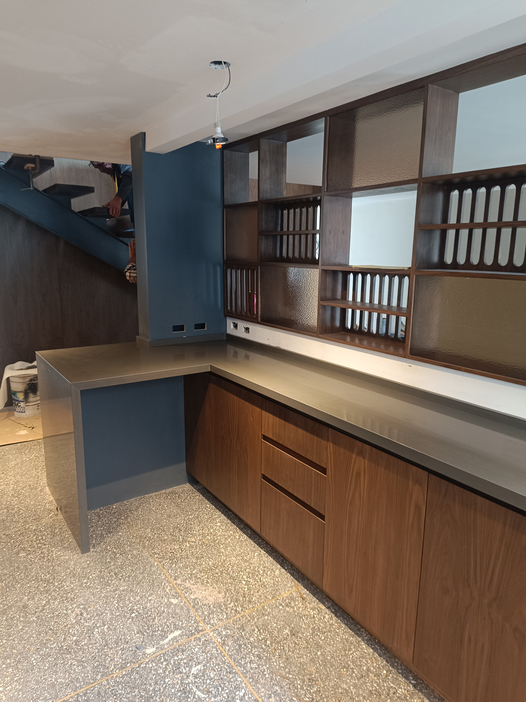
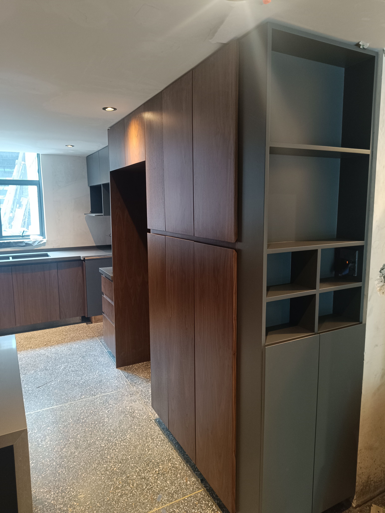
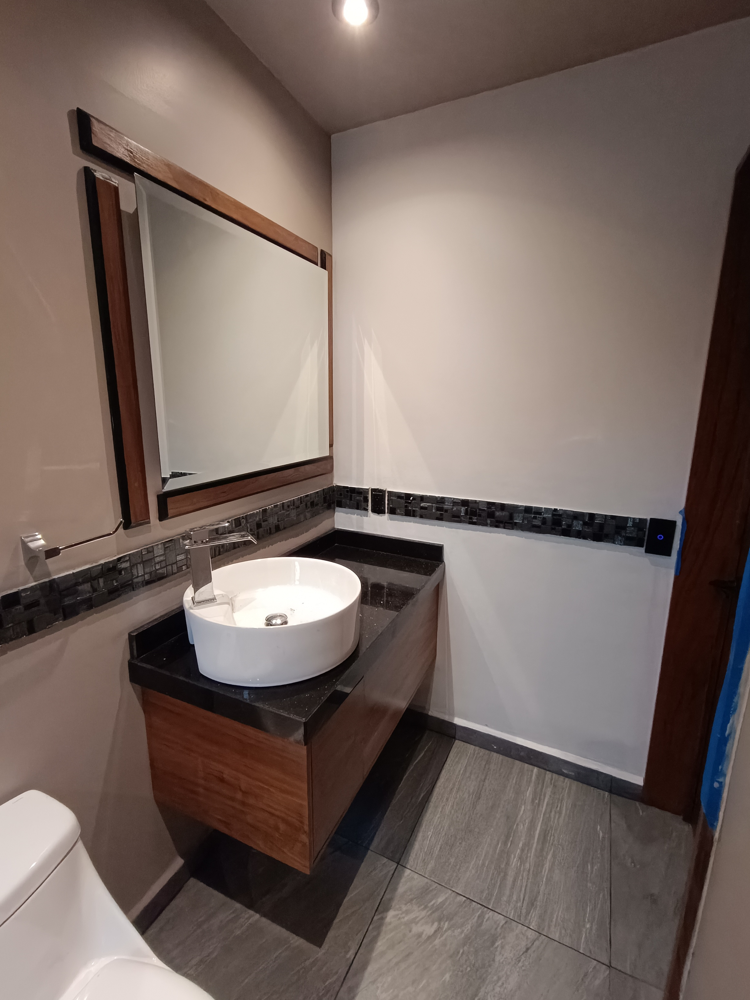

<!DOCTYPE html>
<html lang="es">
<head>
<meta charset="UTF-8">
<meta name="viewport" content="width=device-width, initial-scale=1.0">
<title>Carpintería Contreras</title>

<link rel="preconnect" href="https://fonts.googleapis.com">
<link rel="preconnect" href="https://fonts.gstatic.com" crossorigin>

<link href="https://fonts.googleapis.com/css2?family=Poppins:wght@300;400;600;700&display=swap" rel="stylesheet">

</head>

<body>

<header>

🪵 Carpintería Contreras

<nav>

<a href="#">Inicio</a>
<a href="#servicios">Servicios</a>
<a href="#nosotros">Nosotros</a>
<a href="#galeria">Galería</a>
<a href="#contacto">Contacto</a>

</nav>

</header>

<section class="hero">

<h1>DISEÑAMOS ESPACIOS QUE INSPIRAN</h1>

Fabricamos cocinas, closets, puertas, escritorios y muebles personalizados.

<a href="#contacto" class="btn">
Solicitar Cotización
</a>

</section>

<section id="servicios">

<h2 class="titulo">
Nuestros Servicios
</h2>

<h3>🪑 Muebles</h3>

Diseño y fabricación de muebles personalizados.

<h3>🚪 Puertas</h3>

Puertas de madera modernas y clásicas.

<h3>🛏 Closets</h3>

Closets adaptados a cualquier espacio.

<h3>🍽 Cocinas</h3>

Cocinas integrales de excelente calidad.

</section>

<section id="nosotros">

<h2 class="titulo">
Sobre Nosotros
</h2>

<h2>Más de 10 años de experiencia</h2>

 

Somos especialistas en carpintería residencial y comercial.

Nuestro objetivo es ofrecer muebles duraderos con acabados profesionales.

 

<a href="#contacto" class="btn">
Contáctanos
</a>

</section>

<section id="galeria">

<h2 class="titulo">
Galería
</h2>

</section>

<section id="contacto">

<h2 class="titulo">
Contáctanos
</h2>

<form>

<input type="text" placeholder="Nombre">

<input type="email" placeholder="Correo">

<input type="tel" placeholder="Teléfono">

<textarea placeholder="Escribe tu mensaje"></textarea>

<button>
Enviar
</button>

</form>

<h2>Información</h2>

 

📍 Ciudad de México

 

📞 55 56 6810 9505

 

✉ cocinascontreras@outlook.com

 

Lunes a Sábado

9:00 AM - 7:00 PM

</section>

<footer>

© 2026 Carpintería Contreras| Todos los derechos reservados.

</footer>

</body>
</html>
